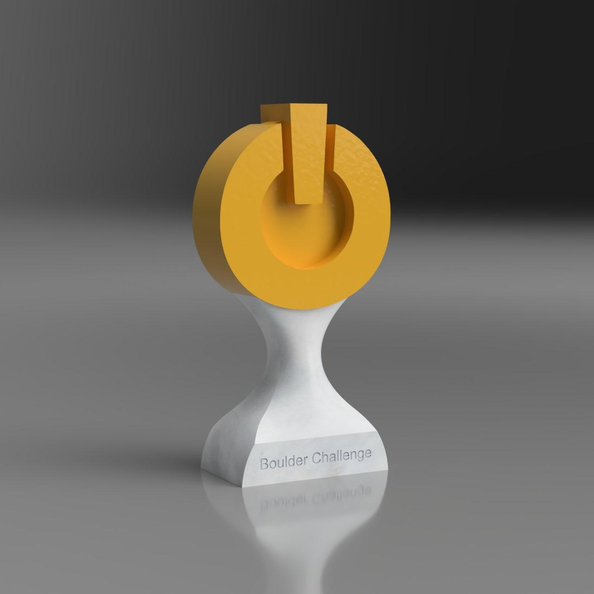

# Smíchoff Trophy
A 3D model of a trophy for the climbing wall [Smíchoff](https://www.lezeckecentrum.cz/cs/), modeled in Fusion 360.

## Build

### Materials
- (required) a 3D printer or a 3D printing service
- (required) superglue or some other way to connect the parts
- (optional) two hex nuts with:
	- diameter across flats: _~29.5mm_
	- height: _~17.5mm_
	- inner circle diameter _~15.5_

### Instructions
1. 3D print `model/bottom.stl`
	- stop at a certain height during the print to insert the hex nuts
2. 3D print `model/top.stl` twice (once normally and once mirrored)
3. put everything together using superglue
4. profit?
