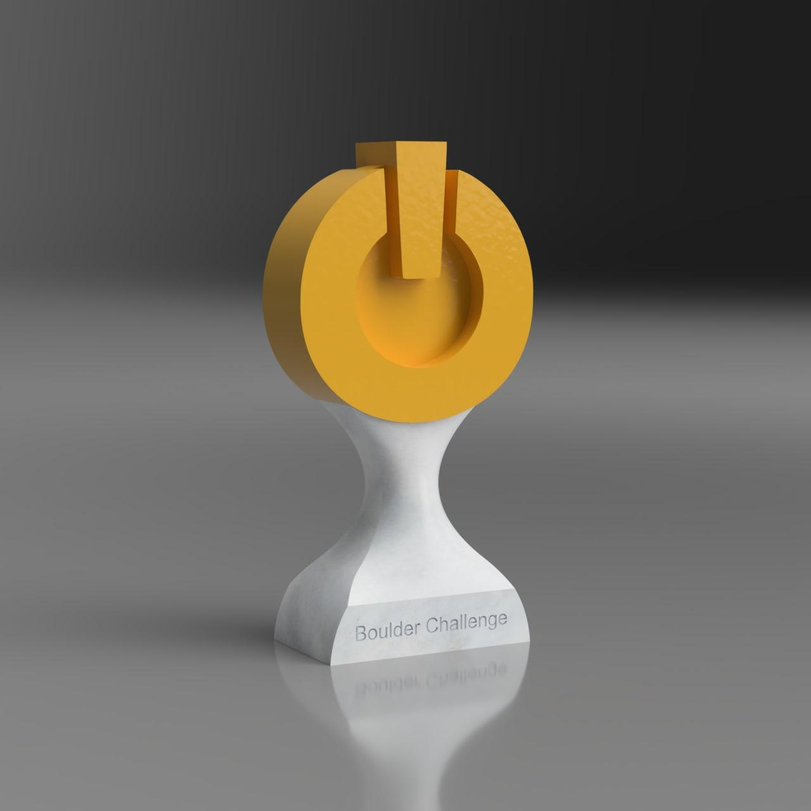

# Smíchoff Trophy (v1)

## Build

### Materials
- (required) a 3D printer or a 3D printing service
- (required) superglue or some other adhesive to connect the parts
- (optional) 2x M20 hex nuts

### Instructions
1. 3D print `bottom.stl`
	- stop at a certain height during the print to insert the hex nuts
	- don't forget to pour in glue before inserting them so they don't move around!
2. 3D print `top.stl` twice (once normally and once mirrored)
3. put everything together using superglue
